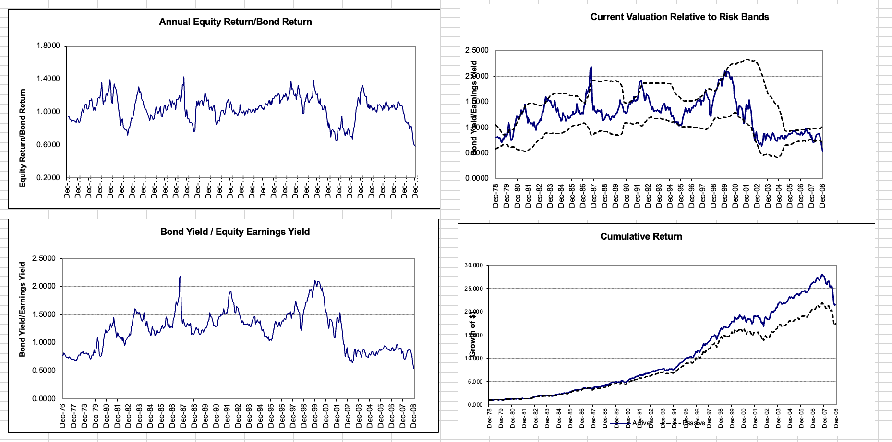

# Significant Relevant Yield (SRY) Model

A tactical asset allocation model that dynamically switches between U.S. equities and U.S. investment grade bonds based on statistical deviations in relative yield valuations. Developed as part of **FIN 645** at the University of Tampa.

> **Disclosure:** Research framework and instructional materials developed as part of FIN 645 coursework. Model construction, analysis, and implementation completed independently.

---

## Files

| File | Description |
|---|---|
| `Significant_Relevant_Yield_Model.xls` | Full SRY model with signal generation, allocation rules, and performance charts |

---

## How the Model Works

The SRY model compares the **equity earnings yield** (inverse of the S&P 500 P/E ratio) against the **bond yield** (Barclays Aggregate) to identify when one asset class is statistically cheap or expensive relative to the other.

A trade signal is generated when the current yield ratio crosses **±2 standard deviations** of its 3-year rolling average — indicating an extreme relative valuation that historically tends to mean revert.

| Signal | Condition | Allocation |
|---|---|---|
| Stocks overvalued | Yield ratio crosses above +2σ band | 100% Bonds |
| Bonds overvalued | Yield ratio crosses below -2σ band | 100% Stocks |
| Neutral | Ratio within bands | Hold current position |

---

## Charts

The four charts show:
- **Annual Equity Return/Bond Return** — cyclical ratio demonstrating mean reversion over time
- **Bond Yield / Equity Earnings Yield** — the core ratio tracked by the model (Dec 1976 – Dec 2008)
- **Current Valuation Relative to Risk Bands** — yield ratio plotted against ±2σ signal bands (Dec 1979 – Dec 2008)
- **Cumulative Return** — SRY strategy (solid) consistently outperforms the benchmark (dashed) over the full period

---

## Key Findings

- The yield ratio peaked significantly above the +2σ band around **1987** and **1999–2000** — both preceding major market drawdowns
- The SRY strategy (solid line) outperformed a static benchmark (dashed line) over the full Dec 1978 – Dec 2008 period
- The model exploits cyclical mean reversion in relative valuations rather than relying on static portfolio weights

---

## Skills Demonstrated

`Tactical Asset Allocation` `Yield Analysis` `Fed Model` `Statistical Signal Generation` `Rolling Window Analysis` `Mean Reversion` `Equity/Bond Relative Valuation` `Excel` `Financial Research`
